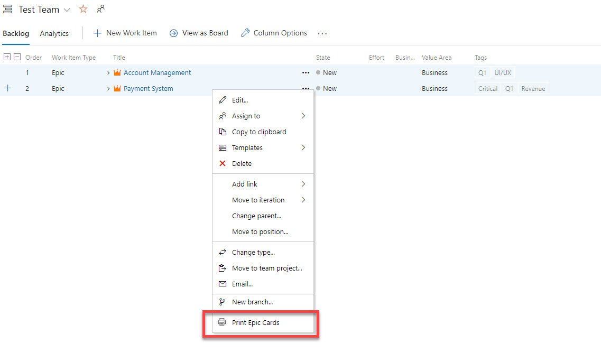
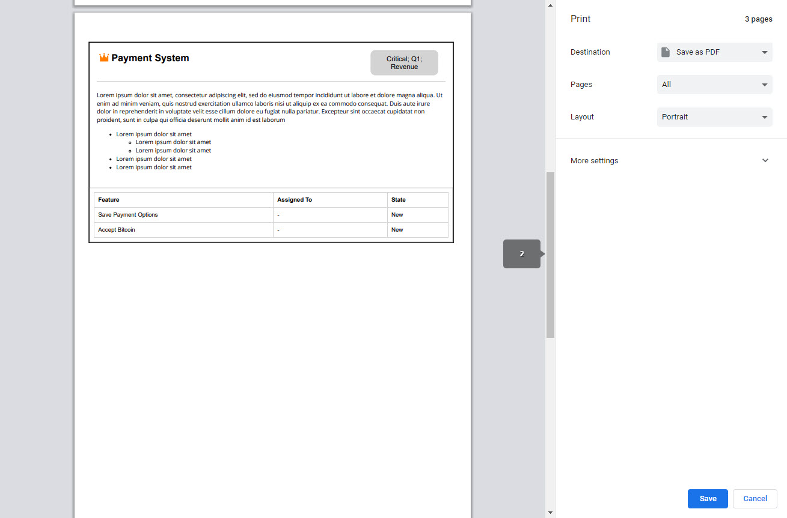

# Print Epic Cards

Prints Epic Cards in a format that I like them for use in physical road mapping. I find that having a physical print out of the Epic makes it easier for my team to take notes during a road mapping session.   

## Print Format
This prints the following fields. Each Epic is printed on a single page.
- Epic Title
- All Epic Tags
- Epic Description
- Features under the Epic
   - Feature Title
   - Assigned To
   - State

   

# Notes
## How To Build Extensions for Azure DevOps
https://docs.microsoft.com/en-us/azure/devops/extend/get-started/node?view=azure-devops

## How to build this extension
1. Install Node
2. `npm install -g webpack tfx-cli` to install global tools
3. Clone the repository
4. `npm install`
5. Build with `npm run build` and upload to your VSTS

## Credits
- Based on [pCards](https://github.com/jeffpriz/pcards)
- Based on [WIPrint](https://github.com/MrTarantula/WIPrint)